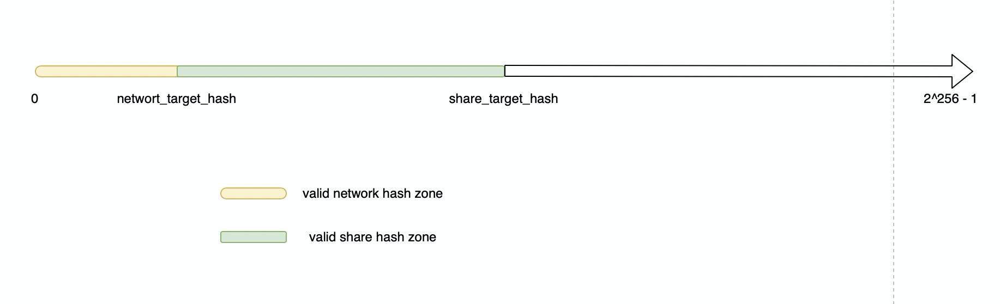
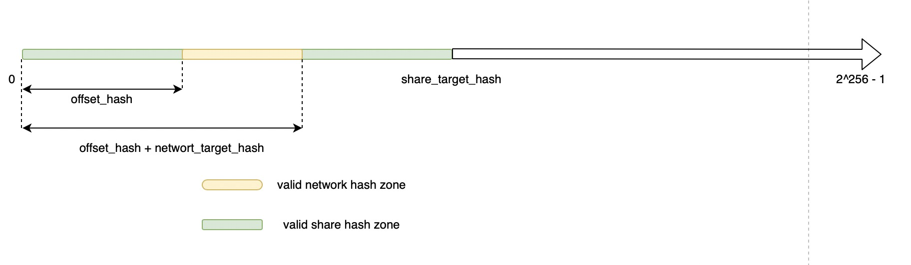

# Solve Block Withholding Attack

## Background
At present, an attacker can harm Pool by intentionally NOT submitting shares 
that are also valid blocks. All pools are vulnerable to this attack, it makes 
the mining pool lose all Bitcoin rewards contained within the block.

How did this happen? This picture illustrates this.



Miner can withhold a valid solution hash after finding one, because the network 
difficulty is fixed(for a particular block height) and miner know the valid network hash zone.
The cost to the miner is trivial (from not being awarded the share) but the cost to the pool 
is large as the pool loses a chance to earn the Bitcoin block award subsidy.

## Proposed Solution
So what if we makes the valid network hash zone movable by add an offset hash on origin valid network hash zone, as below: 



Miner could not judge whether a solution hash is a valid network hash as long as Pool keep offset hash in secret.
We definitely need to restrict offset hash in the valid share hash zone, so Miner still can judge whether a solution hash is a valid share hash.
so problem solved。


## VCash Implementation
1. We use XOR operation to handle offset hash，In contrast with addition，XOR is more effective and don't need to handle boundary case;
1. Pool need to generate different mask_hash for different share_target_hash. This mask_hash should be hidden from Miner, and precommitted in VCash block header. 
It also involve in VCash block header hash computation;
1. When Miner submit a valid share_hash, XOR the share_hash with mask_hash to get a new pow_hash. If this pow_hash satisfy network_difficulty, 
then it's a valid solution. 
Example:
```
    share_hash = DSHA256(bitcoin_header)
    pow_hash = share_hash ^ mask_hash
    pow_hash <= network_target_hash
```